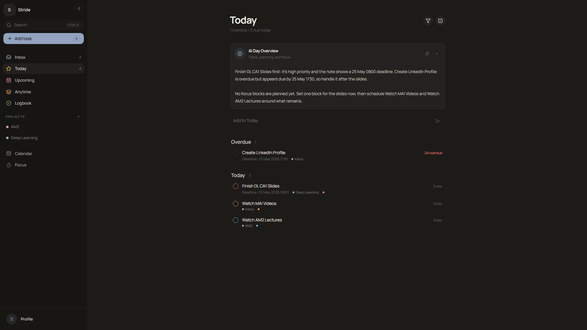
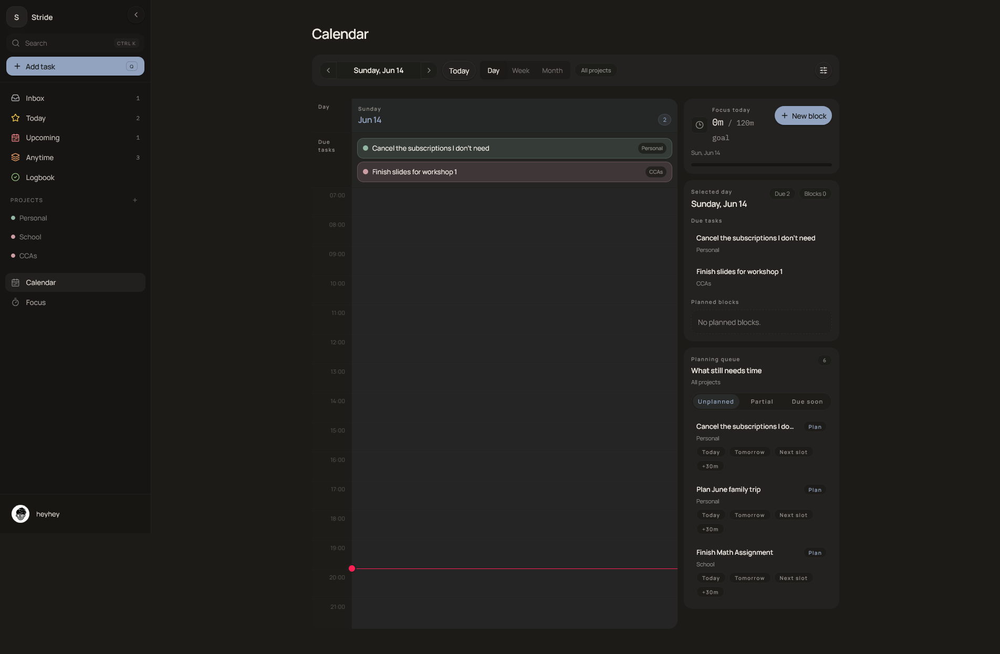
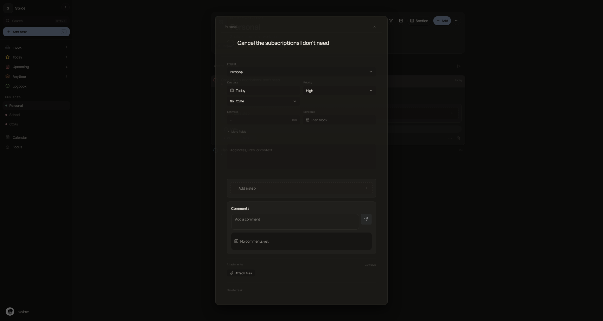
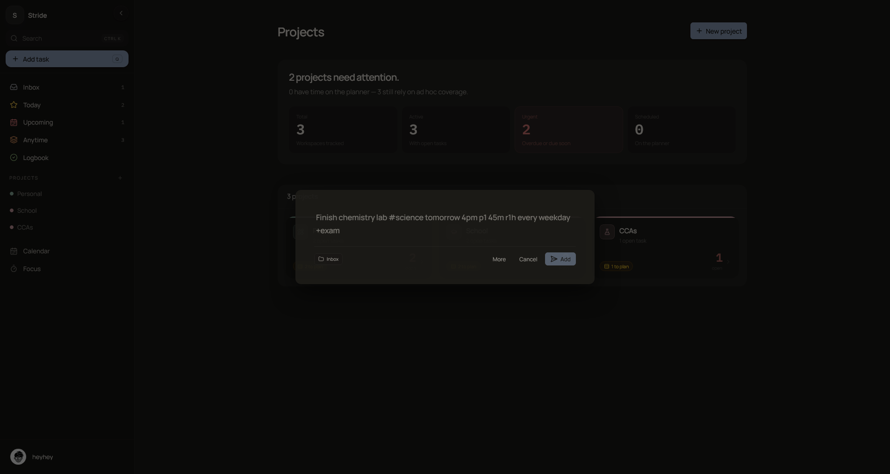
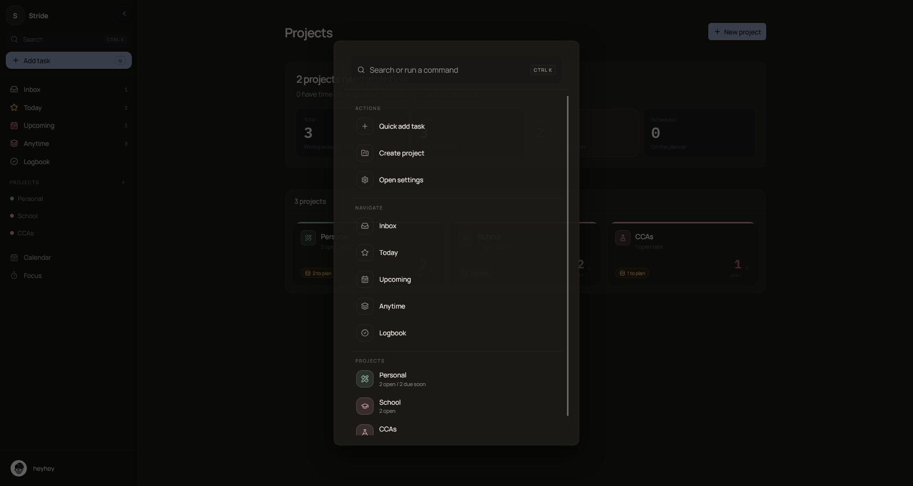
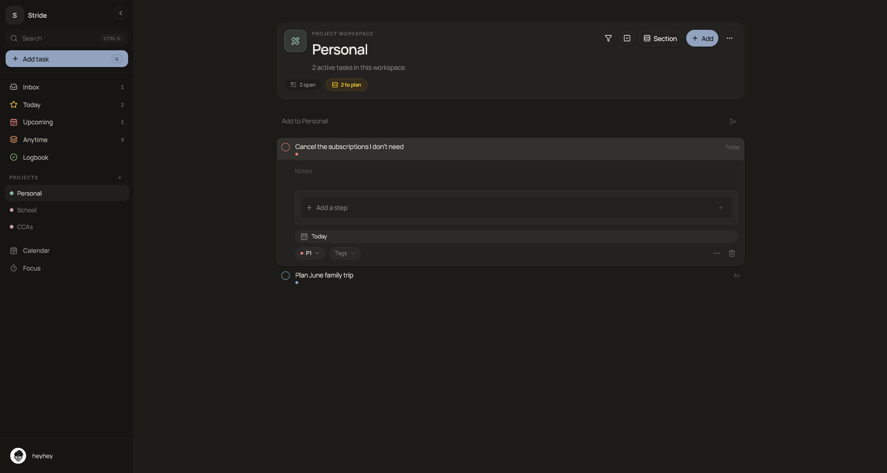
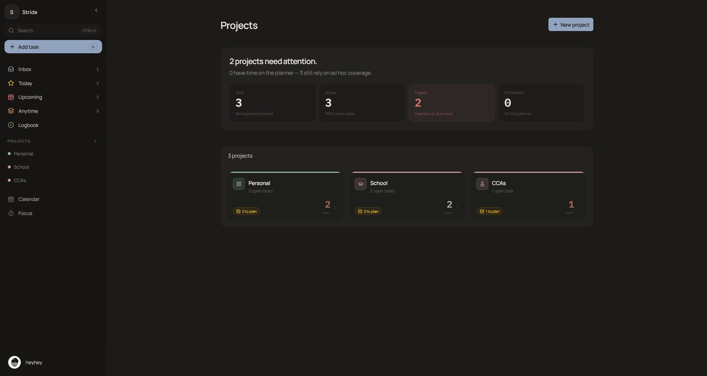
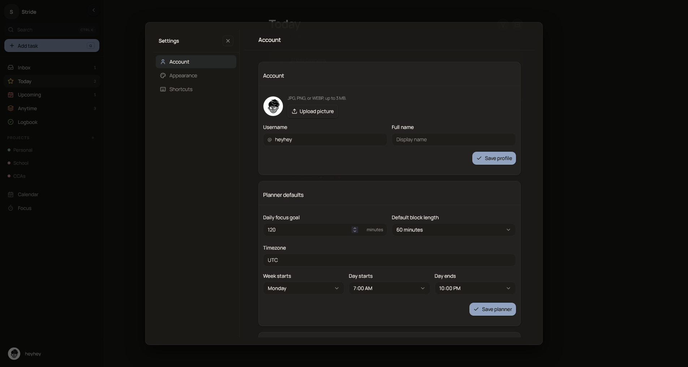
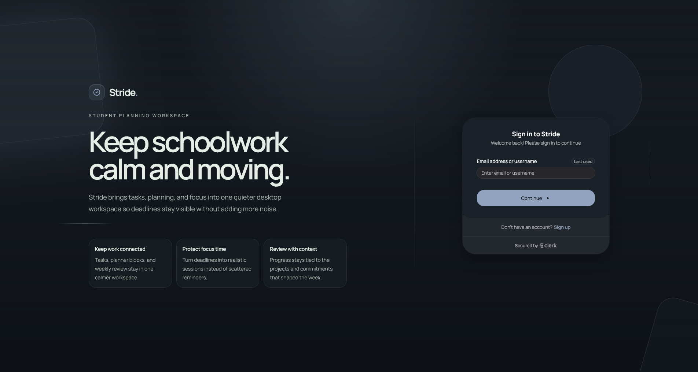

# Stride

Stride was an execution-first student productivity web app that connected tasks, projects, planning, and focus sessions in one workspace.

**Status: archived portfolio MVP. Concluded and not actively maintained.**

The original live deployment is no longer available, and its hosting or external service projects may be decommissioned. The source, screenshots, tests, and final schema baseline are the durable evidence of the project.

Stride is a polished MVP and portfolio artifact, not a production-ready SaaS.

## Portfolio Summary

Stride explored a dense, student-focused productivity workflow where task capture, project planning, calendar blocks, and focus sessions all shared the same workspace. The project focused on the practical loop of deciding what matters, scheduling realistic work, executing with focus sessions, and using that activity to adjust the next plan.

## Product Loop

Stride is built around one practical loop:

1. Capture tasks quickly.
2. Clarify what matters now.
3. Plan realistic focus time.
4. Execute in focused sessions.
5. Adjust the next plan from what happened.

## Final Feature Set

Current App Router surfaces:

- Primary: `/tasks`, `/calendar`, `/focus`, `/projects`
- Secondary: `/settings`
- Auth: `/login`, `/sign-up`; `/sign-in` redirects to the login experience

Auth and onboarding:

- Clerk login and sign-up, mounted through the app routes above
- Server-side route gating for authenticated pages
- Clerk access tokens used with browser and server Supabase clients
- Workspace bootstrap for new users: profile and default Inbox provisioning

Tasks:

- Smart views: Inbox, Today, Upcoming, Anytime, Logbook
- AI Day Overview on Today, generated server-side from visible tasks, descriptions, planning, and focus context
- Anytime shows incomplete tasks with no due date
- Saved task views and filter presets
- Quick Add parser for projects, deadlines, priority, estimates, reminders, recurrence, and labels
- Rich task detail: title, description, project/section, assignee, labels, priority, deadlines, reminders, recurrence, and estimates
- Steps, attachments, comments, assignee foundation, and bulk task actions

Calendar and planning:

- Persisted planned focus blocks, optionally linked to tasks
- Planner filtering and saved planner filters
- Week and month planning surfaces built around persisted blocks and profile preferences

Focus:

- Dedicated focus/break timer surface
- Focus sessions persisted and attributed to task or planned block context when available

Projects:

- Project workspace with list and board views
- Sections with reorder and cross-section task movement
- Membership and invitation UI backed by the shared-list data model
- Collaboration-aware fields such as assignees and comments

Preferences:

- Synced profile preferences: identity, avatar, daily focus goal, timezone, planner defaults, week start, compact mode, project ordering, and accent tokens
- Light, dark, and system themes plus a keyboard shortcut reference

## Architecture Snapshot

- Frontend: Next.js App Router application with React and TypeScript.
- Auth: Clerk handles login, sign-up, route protection, and user identity.
- Data platform: Supabase provides Postgres, Realtime, Storage, and RLS-backed data access.
- App structure: authenticated pages live under `src/app/*` and render inside a shared shell with navigation, command-style actions, user controls, and project access.
- State layers: `DataProvider` manages user profile/preferences and top-level workspace data, `useTaskDataset` powers route-focused task/planning data, and `FocusProvider` manages timer state plus focus session persistence.
- Authorization: Supabase RLS remains the database access boundary, with Clerk access tokens passed to Supabase clients.
- Storage: `todo-images` stores task attachments and `profile-avatars` stores profile images.

Final archived data-model groups:

- Identity and preferences: `profiles`
- Projects and collaboration: `todo_lists`, `todo_list_members`, `todo_sections`
- Tasks and detail data: `todos`, `todo_steps`, `todo_comments`, `todo_images`, `todo_activity_events`
- Labels and saved views: `task_labels`, `todo_label_links`, `task_saved_views`
- Planning and execution: `planned_focus_blocks`, `planner_saved_filters`, `focus_sessions`, `weekly_commitments`

The archived baseline includes RLS policies that separate owned user data from project-member access, plus Realtime publication and Storage policy definitions.

## Tech Stack

- Next.js App Router
- React + TypeScript
- Tailwind CSS + shadcn/ui + Framer Motion
- Clerk for authentication and route protection
- Supabase for Postgres, Realtime, Storage, and RLS-backed data access
- OpenAI Responses API for the AI Day Overview
- Observability/analytics used during development: Sentry, Vercel Speed Insights, PostHog
- Tests: Vitest for semantic utilities and focused behavior coverage

## Screenshots

Every image referenced below exists in `screenshots/`.

| Today | Calendar | Focus |
| :---: | :---: | :---: |
|  |  |  |

| Detailed Task Editor | Quick Add | Search |
| :---: | :---: | :---: |
|  |  |  |

| Project | Project Manager | Settings |
| :---: | :---: | :---: |
|  |  |  |

| Login |
| :---: |
|  |

## Archival / Reference Setup

This setup information is retained for code study and portfolio review. It is not guaranteed to recreate the retired hosted environment without additional Supabase and Clerk configuration. Reuse requires new service projects and credentials.

Prereqs: Node.js + npm, a Clerk application, a Supabase project, and optionally the Supabase CLI.

1. Install dependencies

```bash
npm install
```

2. Configure environment variables

Start from `.env.example`:

```bash
cp .env.example .env
```

Required:

```bash
NEXT_PUBLIC_SUPABASE_URL="https://YOUR_PROJECT_REF.supabase.co"
NEXT_PUBLIC_SUPABASE_ANON_KEY="YOUR_SUPABASE_ANON_KEY"
NEXT_PUBLIC_CLERK_PUBLISHABLE_KEY="pk_test_YOUR_CLERK_PUBLISHABLE_KEY"
CLERK_SECRET_KEY="sk_test_YOUR_CLERK_SECRET_KEY"
```

Optional:

```bash
OPENAI_API_KEY="your_openai_key"
OPENAI_DAY_OVERVIEW_MODEL="gpt-5.5"
NEXT_PUBLIC_POSTHOG_PROJECT_TOKEN="phc_your_project_token"
NEXT_PUBLIC_POSTHOG_HOST="https://us.i.posthog.com"
NEXT_PUBLIC_SENTRY_DSN="https://your-public-sentry-dsn"
SENTRY_DSN="https://your-server-sentry-dsn"
SENTRY_ORG="your-sentry-org"
SENTRY_PROJECT="your-sentry-project"
SENTRY_AUTH_TOKEN="your-sentry-auth-token"
```

`OPENAI_API_KEY` enables the AI Day Overview endpoint. Without it, the endpoint returns a not-configured response. `OPENAI_DAY_OVERVIEW_MODEL` selects the Responses API model and otherwise falls back to the model defined in the route.
PostHog initializes only when both optional PostHog variables are present. Sentry DSNs enable runtime reporting; organization, project, and auth-token values support build-time source-map upload.

3. Restore the archived database reference

The original timestamped Supabase migration history was replaced during archival with a single final baseline migration:

- `supabase/migrations/final_remote_schema_baseline.sql`

This file is the surviving public database reference for the final Stride schema. It captures the remote schema state at archive time, including tables, functions, policies, grants, indexes, and related database configuration represented in SQL.

The baseline is intended for code study and portfolio review. It is not guaranteed to be a clean one-command bootstrap for a new Supabase project. Before reuse, review the SQL carefully and recreate any required external Supabase dashboard configuration, Clerk/Supabase token integration, Storage buckets, and service credentials.

4. Create required Supabase Storage buckets

- `todo-images` for task attachments
- `profile-avatars` for profile images

The archived baseline contains policies that reference these buckets but does not create the bucket rows.

5. Run locally

```bash
npm run dev
```

If PowerShell blocks `npm.ps1`, use:

```bash
npm.cmd run dev
```

## Known Limitations

- The data model evolved through timestamped SQL migrations and is not presented as a fully clean-room reproducible product schema.
- Optimistic UI and realtime updates are used in several flows, but this archive does not claim production-grade reliability.
- Offline-first behavior was not a product guarantee.
- Desktop/PWA packaging was explored separately and was not completed as a release target.
- The live deployment and connected service projects may be disabled, removed, or stale.
- Collaboration foundations exist through memberships, assignees, comments, and realtime data, but the archive does not claim a fully polished multi-user collaboration product.
- AI Day Overview requires an OpenAI API key, model access, and network availability.
- The Vitest suite focuses on semantic and business-logic utilities; browser-level and full integration coverage are limited.
- Stride is a polished MVP, not a production SaaS.

## Testing and Build

Run:

```bash
npm.cmd run test
npm.cmd run lint
npm.cmd run build
```

The Vitest suite covers smart views, deadlines, recurrence, reminders, labels, Quick Add parsing, task ordering, planner filters, planning calculations, project summaries, progress review, estimates, and AI Day Overview prompt preparation. It is not a full end-to-end interaction suite.

## Security / Privacy Note

During development, Stride used external services including Supabase, Clerk, Sentry, Vercel, OpenAI, and PostHog. Before reuse, create fresh service projects, rotate or replace all credentials, review data retention settings, and remove or reconfigure analytics and error reporting. Do not reuse archived production credentials, Sentry DSNs, Supabase projects, Clerk apps, Vercel projects, OpenAI keys, or PostHog project tokens.

Review every RLS and Storage policy before using the archived schema with real data. Sentry is configured to send default personally identifiable information when enabled, so review that setting, consent requirements, and retention before reuse. Keep populated `.env` files, Clerk secrets, OpenAI keys, and Sentry auth tokens out of version control.

## Decommissioning Note

The hosted deployment and external services are paused, deleted, or stale. Portfolio references should point to this repository, its screenshots, and the final schema baseline rather than imply that an actively operated service exists.

## What I Learned

Stride demonstrated that productivity software becomes more useful when capture, planning, and execution share the same data instead of existing as separate tools. Building the MVP made the tradeoffs concrete: dense task metadata needs fast capture; calendar plans need to remain connected to actual work; focus sessions are more informative when attributed back to tasks; and timezone, recurrence, optimistic updates, realtime state, and access control create disproportionate complexity around an otherwise simple task model.

As a portfolio project, its strongest evidence is the integrated product loop and the breadth of implemented detail. Its equally important lesson is scope discipline: collaboration, observability, AI assistance, and deployment operations can be credible MVP foundations without being represented as production maturity.
