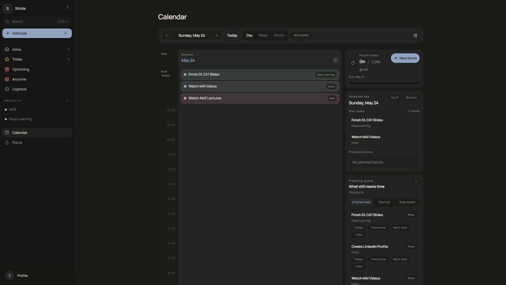
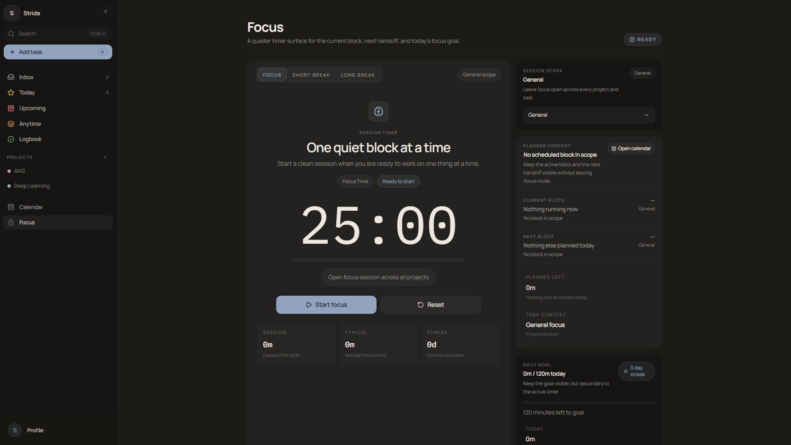
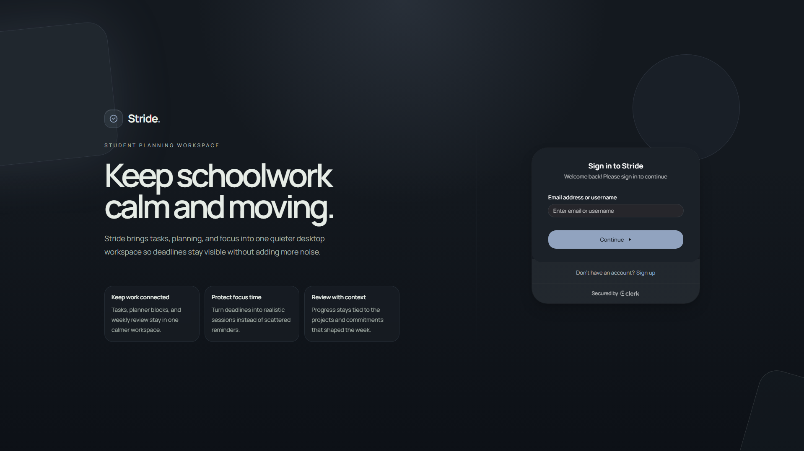

# Stride

Stride is an execution-first student productivity web app that connects tasks, projects, planning, and focus sessions in one workspace.

Live demo: https://stride.rudhresh.app

## What Stride Is

Stride is built around one practical loop:

1. Capture tasks quickly.
2. Clarify what matters now.
3. Plan realistic focus time.
4. Execute in focused sessions.
5. Adjust the next plan from what happened.

## Who It Is For

Students who:

- manage multiple classes, projects, and deadlines
- want one workflow that ties tasks -> planned work -> focus time
- prefer a dense, keyboard-friendly workspace over a lightweight checklist

## Current Product Direction

- Execution-first workflow: tighten the end-to-end task, planning, and focus loop.
- Reliability and consistency: harden optimistic UI, realtime reconciliation, and cross-route behavior.
- Packaging/distribution: keep PWA or desktop packaging separate until the core workflow is dependable.

## Implemented Features

Current App Router surfaces:

- Primary: `/tasks`, `/calendar`, `/focus`, `/projects`
- Secondary: `/settings`
- Auth: `/login`, `/sign-up`; `/sign-in` redirects to the login experience

Auth and onboarding:

- Clerk login and sign-up, mounted through the app routes above
- Server-side route gating for authenticated pages
- Clerk identity tokens used with Supabase clients
- Workspace bootstrap for new users: profile and default Inbox provisioning

Tasks:

- Smart views: Inbox, Today, Upcoming, Anytime, Logbook
- Anytime shows incomplete tasks with no due date
- Saved task views and filter presets
- Quick Add parser for projects, deadlines, priority, estimates, reminders, recurrence, and labels
- Rich task detail: description, labels, priority, deadlines, reminders, recurrence, estimates
- Steps, attachments, comments, assignee foundation, and bulk task actions

Calendar and planning:

- Persisted planned focus blocks, optionally linked to tasks
- Planner filtering and saved planner filters
- Week and month planning surfaces built around persisted blocks and profile preferences

Focus:

- Dedicated focus/break timer surface
- Focus sessions persisted and attributed to task or planned block context when available

Projects:

- Project workspace with list and board views
- Sections with reorder and cross-section task movement
- Membership model in the database for shared lists
- Collaboration-aware fields such as assignees and comments

Preferences:

- Synced profile preferences: timezone, planner defaults, week start, compact mode, shell ordering, and accent tokens

## Gallery

| Tasks | Calendar | Focus |
| :---: | :---: | :---: |
|  |  |  |

| Login |
| :---: |
|  |

## Stack

- Next.js App Router
- React + TypeScript
- Tailwind CSS + shadcn/ui + Framer Motion
- Clerk for authentication and route protection
- Supabase for Postgres, Realtime, Storage, and RLS-backed data access
- Observability/analytics: Sentry, Vercel Speed Insights, PostHog (optional)
- Tests: Vitest for semantic utilities and focused behavior coverage

## Setup / Environment

Prereqs: Node.js + npm, a Clerk application, a Supabase project, and optionally the Supabase CLI.

1. Install dependencies

```bash
npm install
```

2. Configure environment variables

Start from `.env.example`:

```bash
cp .env.example .env
```

Required:

```bash
NEXT_PUBLIC_SUPABASE_URL="https://YOUR_PROJECT_REF.supabase.co"
NEXT_PUBLIC_SUPABASE_ANON_KEY="YOUR_SUPABASE_ANON_KEY"
NEXT_PUBLIC_CLERK_PUBLISHABLE_KEY="pk_test_YOUR_CLERK_PUBLISHABLE_KEY"
CLERK_SECRET_KEY="sk_test_YOUR_CLERK_SECRET_KEY"
```

Optional:

```bash
NEXT_PUBLIC_POSTHOG_PROJECT_TOKEN="phc_your_project_token"
NEXT_PUBLIC_POSTHOG_HOST="https://us.i.posthog.com"
```

PostHog is only initialized when both optional PostHog variables are present.

3. Apply database migrations

- Source of truth: `supabase/migrations/*.sql`
- Recommended: `supabase db push` with the Supabase CLI
- Alternative: apply the SQL files in timestamp order through the Supabase SQL editor

4. Create required Supabase Storage buckets

- `todo-images` for task attachments
- `profile-avatars` for profile images

5. Run locally

```bash
npm run dev
```

If PowerShell blocks `npm.ps1`, use:

```bash
npm.cmd run dev
```

## Current Status

Stride is in active iteration. The core task, project, calendar, and focus workflow is implemented, while reliability and polish remain the main near-term work:

- The data model continues to evolve through SQL migrations.
- Optimistic UI and realtime updates are used in several flows and are being hardened.
- Offline-first behavior is not a product guarantee yet.
- Distribution packaging is planned separately from the hosted web app.

## Next Steps

Near-term priorities are tracked in `docs/todo.md`:

- Add interaction-level regression coverage for high-risk flows.
- Improve rollback and error handling in optimistic mutations.
- Tighten UX consistency and mobile ergonomics across Tasks, Projects, and Calendar.
- Deepen shell actions without inflating global state.
- Revisit packaging only after reliability milestones.
